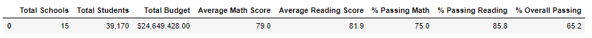
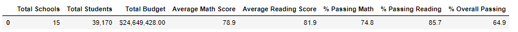
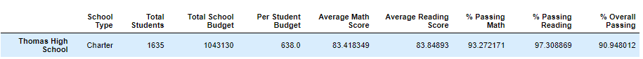
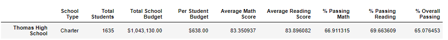
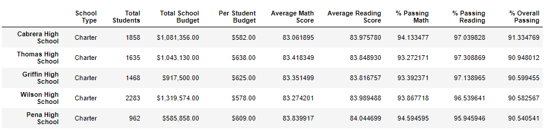
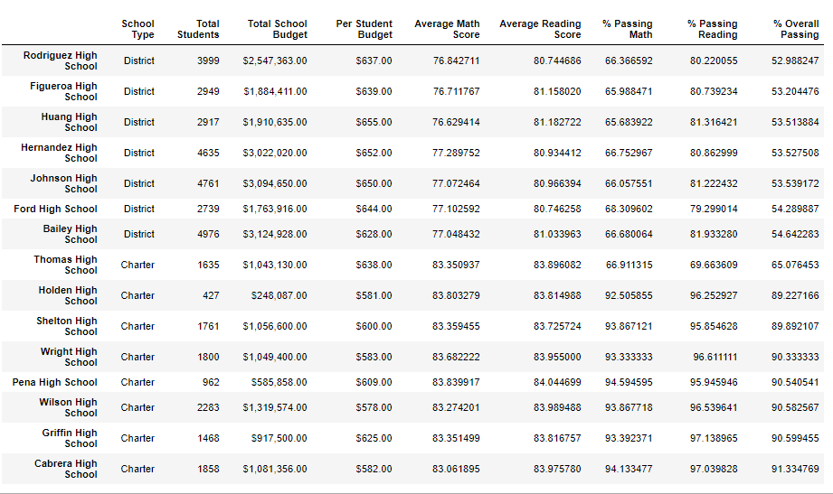

# School_District_Analysis
# School_District_Analysis
## Overview of the school district analysis: Explain the purpose of this analysis.
  The purpose of the analysis is to evaluate the passing rate for reading and math as per the grade level. In addition, we can see whether the spending rage and school size have any impact over the passing rate for the school.
## Results: Using bulleted lists and images of DataFrames as support, address the following questions.

- How is the district summary affected?
  
  Based on the result of the district summary, we can tell the passing rate for math decreased by 0.1% and passing rate for reading decreased by 0.1%. 
  
  Original:
  
  
  Challenge:
  
  
- How is the school summary affected?
  
  As we mark the 9th grade student as NaN, the passing rate for math and reading both slightly decreased from the module result. The passing rates for math and reading both decrease comparing to the original data. The passing rate for math decreased by around 27% from 93.9% to 66.9% and passing rate for reading decrease by 27.6% from 97.3% to 69.7% due to excluding ninth graders’ scores but divided by all students for calculation the passing rate.
  
  Original:
  
  
  
  Challenge:
  
  
  
- How does replacing the ninth graders’ math and reading scores affect Thomas High School’s performance relative to the other schools?
  
  The impact of replacing the ninth graders’ math and reading scores is significant. The passing rate for math decreased by around 27% from 93.9% to 66.9% and passing rate for reading decrease by 27.6% from 97.3% to 69.7% due to excluding ninth graders’ scores but divided by all students for calculation the passing rate. The decrease in overall passing rate leads to drop in school ranking from the 2nd place in original data to  8th place.
  
  Original:
  
  
  
  Challenge:
  
  
  
  
- How does replacing the ninth-grade scores affect the following:
  - Math and reading scores by grade

    Except for ninth-grade scores for reading and math are marked “nan”, all other scores remain the same.
  
  - Scores by school spending

    Scores for spending range in $630-644 decreased. All other ranges remain the same.
  
  - Scores by school size

    Passing rates for math and reading in medium school(1000-2000) decrease comparing to the original data.
  
  - Scores by school type

    Passing rates for math and reading in charter school decrease comparing to the original data.
  

## Summary: Summarize four major changes in the updated school district analysis after reading and math scores for the ninth grade at Thomas High School have been replaced with NaNs.
  1.	The average scores for math and reading have been decreased for Thomas High School due to replacing ninth graders’ scores.
The passing rates of math and reading for Thomas High School have been decreased due to ninth grade student don’t have scores data.
  2.	The decrease in passing rate for math and reading leads to decrease in passing rate for Spending Ranges in $630-644
  3.	Passing rate in school size for range in Medium (1000-2000) also decreased because Thomas High School’s student amount 1635 falls in this range.
  4.	AS Thomas High school is a Charter school, the passing rate for charter schools also decrease.
